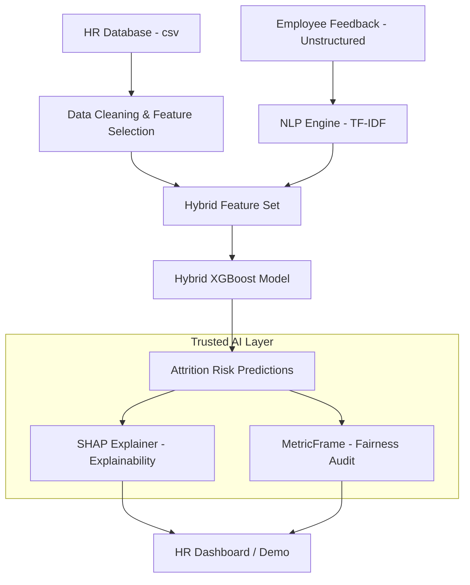

# Architecture Scheme

This document details the data flow and the technical architecture of our Trusted AI solution.

## Data Flow Diagram

## Components Description

1. **Data Ingestion**: Standard HR records merged with simulated unstructured qualitative data from feedbacks.
2. **Feature Engineering**: 
    - **Structured Pipeline**: Normalizes numeric values and encodes categorical demographic data.
    - **NLP Pipeline**: Extracts top-k keyword intensities using TF-IDF Vectorization to capture sentiment and specific concerns (salary, environment).
3. **Core Model**: An XGBoost classifier trained on the concatenated feature vector (Hybrid Model).
4. **Explainability Module**: Uses SHAP (SHapley Additive exPlanations) to attribute prediction scores to specific features, allowing HR to understand *why* an employee is flagged.
5. **Fairness Module**: Uses Fairlearn to audit predictions across sensitive groups (Gender, Race) ensuring no disparate impact.
6. **User Interface**: A proposed web demo (using Streamlit) to visualize the data, the risk, and the justification.
